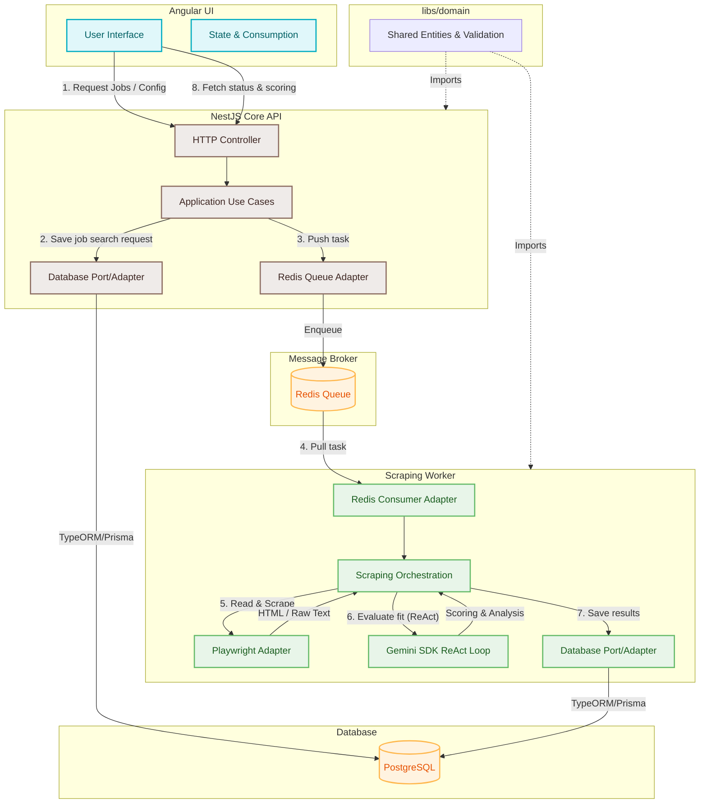

# Job Hunter Platform - Monorepo TypeScript Hexagonal

Bienvenido a la arquitectura del **Job Hunter Platform**, un monorepo políglota diseñado bajo los principios de la **Arquitectura Hexagonal (Puertos y Adaptadores)**. Este sistema permite automatizar la búsqueda, análisis y postulación a ofertas de empleo.

---

## 🏗️ Estructura del Monorepo

La estructura de carpetas se organiza con el patrón `apps/` y `libs/` para separar las aplicaciones de la lógica de dominio compartida:

```text
job_hunter_workspace/
├── apps/
│   ├── api/                 # Backend Core (NestJS API REST - antes backend/)
│   │   ├── application/     # Casos de uso de la aplicación (Lógica de orquestación)
│   │   │   └── use-cases/   # Ejemplo: create-profile.use-case.ts
│   │   └── infrastructure/  # Adaptadores HTTP (NestJS), persistence, queue
│   ├── frontend/            # UI en Angular
│   └── worker/              # Scraping Worker (Node.js/TS)
├── libs/
│   ├── db/                  # Biblioteca compartida de Persistencia (Prisma ORM)
│   │   ├── prisma/          # Esquemas y migraciones SQL
│   │   └── src/             # Cliente de Prisma instanciado
│   └── domain/              # Código Compartido (DRY)
│       ├── entities/        # Entidades (User, Profile, JobOffer como interfaces)
│       ├── ports/           # Puertos (user.repository, profile.repository, job-queue)
│       └── validation/      # Validadores puros del dominio (profile.validator)
└── README.md                # Documentación del sistema
```

---

## 🔄 Diagrama de Flujo del Sistema

El siguiente diagrama de flujo ilustra el ciclo de vida de una solicitud de búsqueda y análisis de ofertas de trabajo:



### Descripción del Flujo:
1. **Configuración e Inicio:** El usuario define filtros de búsqueda en el frontend de **Angular** e inicia el proceso.
2. **Registro de la Búsqueda:** El controlador de **NestJS** en la API recibe la petición, valida la estructura y la almacena en **PostgreSQL**.
3. **Encolado Asíncrono:** Para no bloquear el hilo de ejecución principal, la tarea de scraping se encola en **Redis**.
4. **Consumo de Tareas:** El **Scraping Worker** asíncrono detecta la nueva tarea en la cola de Redis y la extrae para procesarla.
5. **Navegación y Extracción:** El Worker ejecuta **Playwright** en modo headless para navegar por portales de empleo y extraer los detalles de los cargos.
6. **Evaluación Cognitiva:** A través de un bucle de agentes *ReAct*, el Worker consulta la **API de Gemini** enviando el CV del usuario y la oferta obtenida para calcular el porcentaje de afinidad (scoring) y análisis de brechas.
7. **Persistencia:** Los resultados procesados de coincidencia y ofertas se guardan de vuelta en **PostgreSQL**.
8. **Feedback:** La UI en Angular consulta periódicamente el estado final y el scoring para mostrarlos gráficamente.

---

## 🛠️ Stack Tecnológico

* **Lenguaje:** [TypeScript](https://www.typescriptlang.org/)
* **Frontend:** [Angular](https://angular.dev/)
* **Backend:** [NestJS](https://nestjs.com/)
* **Worker Execution:** [Node.js](https://nodejs.org/) & [Playwright](https://playwright.dev/)
* **Base de Datos:** [PostgreSQL](https://www.postgresql.org/) con [Prisma ORM](https://www.prisma.io/)
* **Cola de Mensajes:** [Redis](https://redis.io/) (utilizando BullMQ o similar)
* **Inteligencia Artificial:** [Gemini SDK](https://ai.google.dev/) (Bucle de Razonamiento ReAct)

---

## 📐 Reglas de Arquitectura

Para mantener la base de código limpia y mantenible a escala Enterprise, se deben seguir las siguientes reglas:

1. **Principio de Aislamiento del Dominio (Hexagonal):**
   * El código dentro de `libs/domain` no puede importar nada de `application/` ni de `infrastructure/`.
   * Los modelos y entidades se definen en `libs/domain/entities/` como interfaces de datos libres de decoradores (Dominio Anémico).
   * Los puertos (interfaces que definen contratos para bases de datos, APIs de IA, etc.) se definen en `libs/domain/ports/`.

2. **Casos de Uso Autocontenidos (`application/`):**
   * La lógica de aplicación y flujos de negocio secuenciales se implementan dentro de `use-cases/`.
   * Estos dependen únicamente del dominio y de los puertos (Inversión de Dependencias).

3. **Adaptadores Desacoplados (`infrastructure/`):**
   * Cualquier framework (NestJS), SDK (Playwright, Gemini) o base de datos es un detalle técnico.
   * Su código debe residir en `infrastructure/adapters/` implementando las interfaces de los puertos.
